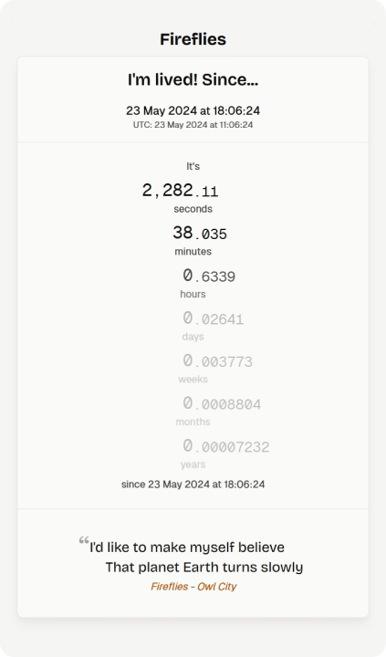

# ✨ Fireflies

"I'd like to make myself believe that planet Earth turns slowly" - Fireflies by Owl city

## About

> The motion of the earth is anything but slow. It actually [spins on it’s axis at about 1,000 miles per hour (1,600 kph)](https://earthsky.org/earth/why-cant-we-feel-earths-spin/). It also moves around the sun at 67,000 miles per hour. We can’t feel its motion because we (and everything else) are also moving along with it at a constant rate.

Try it now ✨ [https://fireflies.minhle.space][website]

[website]: https://fireflies.minhle.space

## Usage

You can access the application at [https://fireflies.minhle.space][website]. By default, Fireflies will capture the timestamp at the moment you connect to the application.

If you wish to count from a specific milestone (such as birthdays, anniversaries, deadlines, etc.), you can use the following URL formats:

- **ISO Format**: https://fireflies.minhle.space?t=2024-05-23T11:06:24.000Z
- **YYYY-MM-DD HH:mm:ss Format**: [https://fireflies.minhle.space?t=2024-05-23 11:06:24](https://fireflies.minhle.space?t=2024-05-23%2011:06:24)
- **Milliseconds Since Epoch**: https://fireflies.minhle.space?t=1716462384000
- **Seconds Since Epoch**: https://fireflies.minhle.space?t=1716462384

Simply replace the timestamp in the URL with your desired milestone to start counting from that point.
